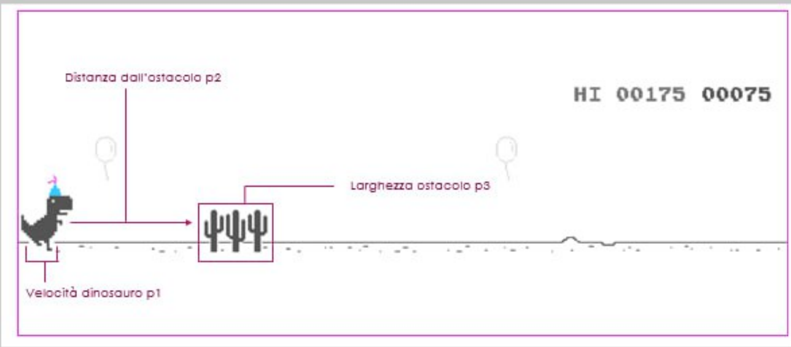

# Progetto Dino AI

## Fondamenti di Intelligenza Artificiale - Università degli Studi di Salerno (UNISA)
### Professore: F. Palomba

Lo scopo di questo progetto è creare un'intelligenza artificiale in grado di giocare al gioco Dino Chrome. Il gioco, sviluppato nel 2014 da Sebastian Gabriel, consiste nel far saltare un dinosauro per evitare ostacoli, come cactus e pterodattili, che si muovono sempre più velocemente man mano che il gioco avanza. Il nostro obiettivo è implementare un algoritmo che permetta al dinosauro di imparare autonomamente a saltare gli ostacoli, migliorando ad ogni mutazione ogni volta che il dinosauro colpisce un ostacolo.

### Algoritmo Genetico

L'approccio principale utilizzato per l'addestramento dell'intelligenza artificiale è stato l'algoritmo genetico, che prevede le seguenti fasi:

1. **Selezione**: Identificare i migliori individui, basati sul loro punteggio di performance nel gioco.
2. **Crossover**: Creare nuovi individui combinando le caratteristiche dei migliori individui selezionati.
3. **Mutazione**: Introdurre piccole variazioni casuali nelle caratteristiche degli individui, per favorire l'esplorazione del territorio di ricerca.
4. **Valutazione**: Valutare le performance degli individui nella nuova generazione e ripetere il processo di selezione, crossover e mutazione.

### Strumenti Utilizzati

- Sviluppo dell'algoritmo genetico con Node.js.
- Documentazione scritta con Overleaf.

## Partecipanti

- Emanuele Riccardi
- Luigi Emanuele Sica
